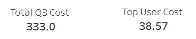
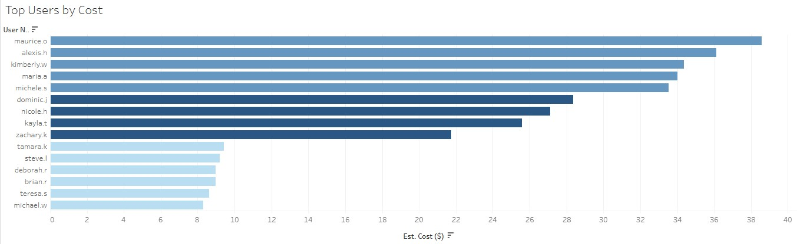
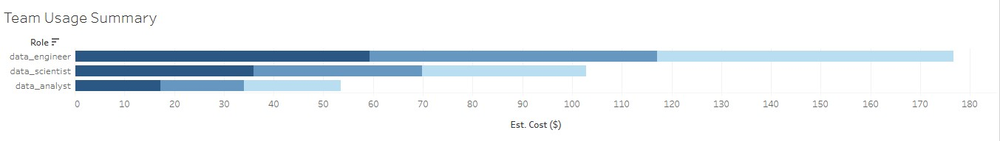
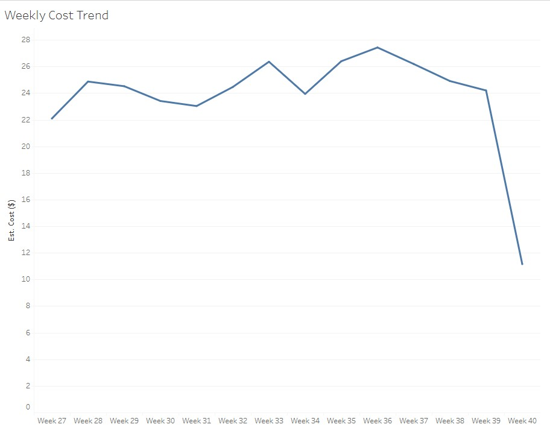
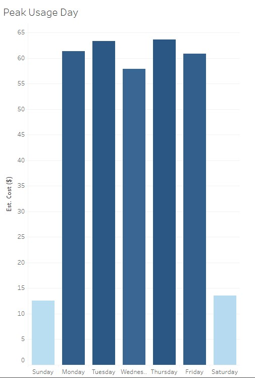

# bigquery-usage-monitor

## Dashboard Overview

There was a time where our BigQuery reached the query usage limit, and the whole data division was down, because it wont run any query for some times. So, this dashboard provides insights into query costs, user behavior, and usage patterns across the team, to drive cost awareness across team members.

This dashboard using a dummy data generated using python to mimick a real world case that happened during my data engineering internship period. 

The live Tableau dashboard can be accessed here: [Live Dashboard](https://public.tableau.com/views/Q3BigQueryUsageMonitoringDashboard/Dashboard1?:language=en-US&:sid=&:redirect=auth&:display_count=n&:origin=viz_share_link)

---

## Key Performance Indicators

### Total Q3 Cost

The total Q3 cost metric provides the amount of usage cost for the entire team in a quarter period. It shows that the usage cost of 2025 Q3 period is 333 USD. 

### Top User Cost

The top user cost metric highlights the highest individual contributor to BigQuery costs during Q3. Highlighting the highest usage cost by a team member, wich is about 38 USD.
This helps identify users and potential optimization opportunities by focusing on the most expensive user's query patterns and usage behavior.

---

## Usage Visualizations

### 1. Users Usage by Cost

This horizontal bar chart ranks users by their estimated BigQuery costs, with color coding to indicate the roles. The visualization helps identify the primary cost drivers within the team and enables targeted optimization efforts for high-cost users.

From the chart, we can see the detailed usage cost from each team member in each data division. The data engineers have the higher amount of usage than the analysts and scientists, where team member named Maurize reached 38 USD of usage cost, while all the data scientists usage not reached 10 USD. 

### 2. Team Usage Summary

This stacked horizontal bar chart breaks down estimated costs by role inside the team, and month of query execution. The visualization provides insights into how different team roles (data engineers, data scientists, data analysts) contribute to overall costs and how usage patterns have evolved across the quarter.

We can see that data engineers tend to have higher usage than data analysts and scientist overall, also in each month.

### 3. Weekly Cost Trend

This line chart displays the estimated BigQuery costs over a 14-week period from Week 27 to Week 40 in Q3 of the year. The trend analysis reveals cost patterns over time, highlighting periods of increased or decreased usage and helping identify any anomalies or significant changes in spending behavior.

We can see that the usage is peaking on week 37, which can indicate if there were a major ocassion that needed a lot of querying from the data team. 

### 4. Peak Usage Day (Daily Usage)

This bar chart shows the estimated costs for each day of the week, identifying which days experience the highest BigQuery usage. Understanding daily usage patterns helps with capacity planning and can reveal workflow patterns that drive cost fluctuations throughout the week. 

From the chart, showing that Wednesdays is the lowest usage day, while Tuesdays and Thursdays being higher than the other, while Mondays and Fridays being in the middle of usage volume.

---

